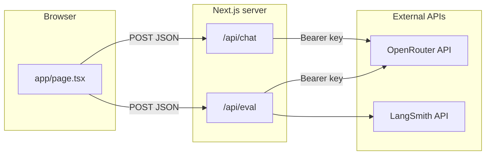

# eval-llm

A **Next.js (App Router)** playground that runs a **primary LLM** through [OpenRouter](https://openrouter.ai/), then scores the answer with a **separate evaluator model**. Results can be traced in **[LangSmith](https://smith.langchain.com/)** (optional). The UI presents a document-style query column, a floating evaluation card, and session history.

**Live demo:** Deploy to [Vercel](#deploying-to-vercel) (see below).

---

## Features

- **Primary chat** — User submits a query; the app calls `POST /api/chat`, which forwards to OpenRouter with your server-side API key (never exposed to the browser).
- **Automated evaluation** — After a successful primary response, the app calls `POST /api/eval` with the query and response. A grader model returns JSON: overall score (0–1), pass/fail (≥ 0.7), reasoning, and four boolean criteria (`factually_accurate`, `relevant_to_query`, `concise`, `helpful`).
- **LangSmith (optional)** — Each eval can open a LangSmith `RunTree` trace, finalize outputs, and attach feedback under the key `accuracy`. If `LANGSMITH_API_KEY` is unset, the app still runs; traces are skipped with a console warning.
- **Session history** — Last 10 runs (query snippet, score, pass/fail, timestamp) stored in React state only (no database).
- **UI** — Tailwind CSS v4, editorial + soft-SaaS layout (Lora + DM Sans), responsive two-column layout.

---

## Architecture



- **Secrets** (`OPENROUTER_API_KEY`, LangSmith keys) stay in environment variables and are only read in **Route Handlers** and server-side helpers.
- **Eval automation / tests** can call the same routes as the UI; see [`lib/chat-api-client.ts`](lib/chat-api-client.ts) for a typed client to `/api/chat`.

---

## Tech stack

| Layer | Choice |
|--------|--------|
| Framework | Next.js 15 (App Router) |
| Language | TypeScript (strict) |
| Styling | Tailwind CSS v4 (`@tailwindcss/postcss`) |
| Primary inference | OpenRouter `https://openrouter.ai/api/v1/chat/completions` |
| Observability | `langsmith` (RunTree + Client) |

---

## Prerequisites

- **Node.js** 18.x or newer (20 LTS recommended)
- **npm** (or pnpm/yarn with equivalent commands)
- Accounts (free tiers available): [OpenRouter](https://openrouter.ai/), optionally [LangSmith](https://smith.langchain.com/)

---

## Local development

### 1. Clone and install

```bash
git clone https://github.com/NaimaBogran/eval-llm.git
cd eval-llm
npm install
```

### 2. Environment variables

Copy the example file and add your keys:

```bash
cp .env.local.example .env.local
```

| Variable | Required | Description |
|----------|----------|-------------|
| `OPENROUTER_API_KEY` | **Yes** | [OpenRouter API key](https://openrouter.ai/keys). Used by `/api/chat` and `/api/eval`. |
| `OPENROUTER_MODEL` | No | Primary chat model (default: `openai/gpt-4o-mini`). |
| `OPENROUTER_EVAL_MODEL` | No | Evaluator / grader model (default: `openai/gpt-4o-mini`). |
| `OPENROUTER_HTTP_REFERER` | No | Optional. Sent as `HTTP-Referer` to OpenRouter ([attribution](https://openrouter.ai/docs)). |
| `OPENROUTER_APP_TITLE` | No | Optional. Sent as `X-Title` to OpenRouter. |
| `LANGSMITH_API_KEY` | No | If set, enables traces and feedback. |
| `LANGSMITH_PROJECT` | No | Defaults to `llm-eval-playground`. |
| `LANGSMITH_TRACING` | No | Set to `true` to enable tracing on RunTree when using LangSmith. |

`.env.local` is gitignored; never commit real secrets.

### 3. Run

```bash
npm run dev
```

Open [http://localhost:3000](http://localhost:3000). Submit a query with **Run eval** to run the primary model, then the evaluator.

### Other scripts

| Command | Purpose |
|---------|---------|
| `npm run build` | Production build |
| `npm run start` | Start production server (after `build`) |
| `npm run lint` | ESLint |

---

## API reference (for integrations)

All request/response bodies are JSON. Types live in [`lib/types/chat.ts`](lib/types/chat.ts) and [`types/eval.ts`](types/eval.ts).

### `POST /api/chat`

**Body (one of):**

- `{ "prompt": "string" }` — single user turn, or  
- `{ "messages": [ { "role": "system" \| "user" \| "assistant", "content": "string" } ] }`

**Success (200):** `{ "content": string, "model": string, "id"?: string }`

**Error:** `{ "error": string, "status"?: number }` with non-2xx status.

### `POST /api/eval`

**Body:** `{ "query": string, "response": string }` (the LLM answer to grade).

**Success (200):** [`EvalResult`](types/eval.ts) — includes `score`, `pass`, `reasoning`, `criteria`, and optionally `langsmith_run_id` / `langsmith_url` when LangSmith created a run.

**Errors:** Invalid JSON or missing fields → `400` with `{ "error": string }`. Missing `OPENROUTER_API_KEY` on the server → `500`.

The grader is instructed to return **only** JSON (no markdown). If parsing fails, the route still returns **200** with a fallback result (`score: 0`, safe criteria), so clients should always handle the success shape.

### Programmatic chat client

```ts
import { callChatApi } from '@/lib/chat-api-client';

const result = await callChatApi('http://localhost:3000', {
  prompt: 'Hello',
});
// result.ok === true → result.data.content
```

Use your deployed origin in production instead of `localhost`.

---

## Deploying to Vercel

Next.js is a first-class runtime on Vercel; this repo needs **no custom `vercel.json`** for a standard deploy.

### Steps

1. Push this repository to GitHub (already at [NaimaBogran/eval-llm](https://github.com/NaimaBogran/eval-llm)).
2. Go to [vercel.com](https://vercel.com/) and sign in (e.g. with GitHub).
3. **Add New Project** → **Import** `NaimaBogran/eval-llm`.
4. **Framework Preset:** Next.js (auto-detected).  
   **Root Directory:** leave default (repository root) unless you moved the app into a subfolder.
5. **Environment Variables** — add the same keys you use locally (minimum **`OPENROUTER_API_KEY`**).  
   - Copy names from [`.env.example`](.env.example).  
   - For production, set **`OPENROUTER_HTTP_REFERER`** to your Vercel URL (e.g. `https://eval-llm.vercel.app`) so OpenRouter attribution matches your deployment.
6. Click **Deploy**.

After deploy, Vercel runs `npm run build` and serves the App Router and API routes as serverless/Node functions.

### Post-deploy checklist

- [ ] `OPENROUTER_API_KEY` set in Vercel **Production** (and **Preview** if you want PR previews to call OpenRouter).
- [ ] Optional: LangSmith vars if you want traces from production.
- [ ] Smoke-test: open the production URL, run one query + eval, confirm scores and (if configured) LangSmith links.

### Limits and notes

- **Cold starts:** First request after idle may be slower (typical for serverless).
- **Secrets:** Configure only in the Vercel dashboard or linked secret store—never commit `.env.local`.
- **Rate limits:** OpenRouter and LangSmith quotas apply per their dashboards.

---

## Project layout (high level)

```
app/
  api/chat/route.ts    # Primary OpenRouter proxy
  api/eval/route.ts    # Evaluator + LangSmith finalize
  page.tsx             # Main UI
  layout.tsx           # Fonts + shell
lib/
  config.ts            # Model defaults + OpenRouter URL
  langsmith.ts         # createEvalRun / finalizeRun
  chat-api-client.ts   # Typed fetch helper for /api/chat
  types/chat.ts
types/eval.ts          # EvalRequest, EvalResult, etc.
```

---

## Troubleshooting

| Issue | What to check |
|--------|----------------|
| `OPENROUTER_API_KEY is not set` | `.env.local` locally, or Vercel **Environment Variables** for all relevant environments. |
| Eval always low score / parse errors | Model sometimes wraps JSON in markdown; the route tries to extract JSON. Try a stronger `OPENROUTER_EVAL_MODEL`. |
| LangSmith link 404 or no trace | Key/project wrong, or tracing disabled; check LangSmith project name matches `LANGSMITH_PROJECT`. |
| Build fails on Vercel | Node version: set **18** or **20** in Project Settings → General → Node.js Version if needed. |

---

## License

This project is provided as-is for evaluation and learning. Add a `LICENSE` file if you need a specific open-source terms.

---

## Links

- [OpenRouter](https://openrouter.ai/) — models and API keys  
- [OpenRouter chat API](https://openrouter.ai/docs)  
- [Vercel Next.js docs](https://vercel.com/docs/frameworks/nextjs)  
- [LangSmith](https://docs.smith.langchain.com/)
